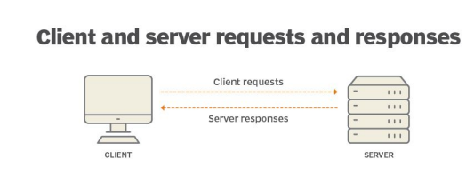
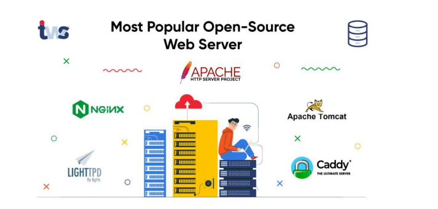

## 1) What is protocol stack and how its used in web development?

Ans) Protocol stack is set of rules, for client and server communication, which takes place via request and response.

Its used in web development for communication between client & server at different layers of communication.

There are major 4 layers in protocol stack:
 - Link Layer, for connecting devices via ethernet or WireLess LAN, and transfering data in bits.
 - Network Layer: It identifies devices by IP address to know who is sending and recieving data. It uses IP4/6 protocol
 - Transport Layer protocol: Here data is broken into small packets, which is again reassembled at the destination by TCP/UDP protocol.
 - Application layer protocol: Here the browser loads the application by identifying its domain name with respective IP address and uses HTTPS for communication to server.

## 2) What are the different types of web servers, and how do they differ in terms of functionality and performance?

There different types of server each serving its own purpose:

For example:
 - DNS server is used to locate the IP address for server that browser/client is requesting.
 - Database server is used to store data in organised manner with CRUD functionality.

Along with this we also have open source servers:

- Apache HTTP Server: This is the most popular web server in the world, and it is known for its stability and performance. Apache is a good choice for websites with a high volume of traffic.
- Nginx: Nginx is a newer web server that is gaining popularity due to its high performance and scalability. Nginx is a good choice for websites that need to handle a lot of traffic, but it can also be used for smaller websites.

In terms of functionality, web servers can be divided into two main categories: static web servers and dynamic web servers. Static web servers serve static content, such as HTML pages and images. Dynamic web servers can generate dynamic content, such as web pages that are personalized for each user.

In terms of performance, web servers are typically measured by their ability to handle concurrent requests. The number of concurrent requests that a web server can handle depends on a number of factors, including the hardware that the web server is running on, the software that the web server is using, and the number of resources that the web server is serving.

## What is web hosting, and what are the different types of hosting services available for websites?

Web hosting is the service of storing and delivering web pages to users. When you create a website, you need to find a web hosting provider to store your website's files and make them accessible to users.

There are many different types of web hosting services available, but some of the most popular include:

- Shared hosting: Shared hosting is the most affordable type of web hosting. With shared hosting, your website shares a server with other websites. This can lead to performance issues if your website gets a lot of traffic.

- Cloud Hosting: Cloud web hosting is a type of web hosting service where a website is hosted on virtual servers that are part of a larger network of physical servers interconnected in the cloud. Instead of being hosted on a single physical server, the website's data and resources are distributed across multiple servers, which are often located in different data centers and regions.
 - Managed Hosting: Managed web hosting is a hosting service where the web hosting provider takes care of all the technical aspects of running a website. This includes server setup, configuration, maintenance, security updates, and performance optimization. With managed hosting, website owners can focus on their content and business, while leaving the technical management to the hosting provider.
- Virtual private server (VPS) hosting: VPS hosting is a more expensive type of web hosting than shared hosting. With VPS hosting, you get your own virtual server, which means that you don't have to share resources with other websites. This can improve performance and give you more control over your website.
- Dedicated hosting: Dedicated hosting is the most expensive type of web hosting. With dedicated hosting, you get your own physical server. This gives you the most control over your website and the best performance.

## What is scaling, and why is it important for web applications? How does scaling differ for vertical and horizontal scaling?

Scaling is the process of increasing the capacity of a web application to handle more traffic. There are two main types of scaling: vertical scaling and horizontal scaling.

- Vertical scaling: Vertical scaling involves increasing the resources of the web server, such as the amount of RAM, CPU, or storage. This can be a good option for small to medium-sized web applications.
- Horizontal scaling: Horizontal scaling involves adding more web servers to the cluster. This can be a good option for large web applications that need to handle a lot of traffic.

Vertical scaling is typically easier to implement than horizontal scaling, but it can be more expensive. Horizontal scaling is more scalable than vertical scaling, but it can be more complex to implement.

## What is SEO (Search Engine Optimization), and how can web developers optimize their websites for better search engine rankings?

SEO (Search Engine Optimization) is the process of improving the visibility of a website in search engine results pages (SERPs). There are many factors that can affect a website's ranking in SERPs, including the quality of the content, the use of keywords, and the structure of the website.

Web developers can optimize their websites for SEO by following these tips:

- Use high-quality content that is relevant to the target audience.
- Use relevant keywords throughout the website, including in the title tag, meta description, and content.
- Structure the website in a way that is easy for search engines to crawl and index.
